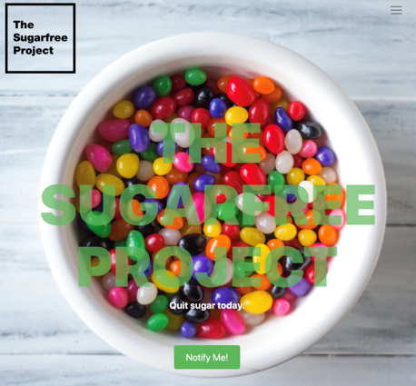

<h1 align="center">
  <br>
  TheSugarFreeProject
  <br>
  <br>
  
  <br>
</h1>

<h4 align="center">
  這是一個幫助糖分成癮患者逐日減少糖分攝取，控制健康的APP
  <br><br>
  Made with React Native.
</h4>

<br>
<br>

<p align="center">

</p>

<br>
<br>

## Prerequisite

1. It is required to have NodeJs with version 8.5 or higher

2. If you do not have installed node.js in your machine then go to [this link](https://nodejs.org/en/download/) in order to install node.

## How to use

best-resume-ever requires at least node v.8.5.0.

1. Clone this repository.
```
git clone https://github.com/salomonelli/best-resume-ever.git
```

2. Go to the cloned directory (e.g. `cd best-resume-ever`).

3. Run `npm install`.

4. Customize your resume in the `resume/` directory: edit your data `data.yml` and replace your profile-picture `id.jpg`.

5. Preview resumes with `npm run dev`.

6. Export with `npm run export`.


All resumes will be exported to the `pdf/` folder.

<br>


## Creating and Updating Templates

Please read the <a href="DEVELOPER.md">developer docs</a> on how to create or update templates.

<br>


## Contribute

Feel free to add your own templates, language supports, fix bugs or improve the docs. Any kind of help is appreciated! If you make any kind of changes to an existing template, please commit them as new templates.

<br>


## Credits

This project uses several open source packages:

* <a href="https://github.com/vuejs/vue" target="_blank">Vue</a>
* <a href="https://github.com/GoogleChrome/puppeteer" target="_blank">Puppeteer</a>
* <a href="https://github.com/less/less.js" target="_blank">LESS</a>

<br>


---

> [sarasteiert.com](https://www.sarasteiert.com) &nbsp;&middot;&nbsp;
> GitHub [@salomonelli](https://github.com/salomonelli) &nbsp;&middot;&nbsp;
> Twitter [@salomonelli](https://twitter.com/salomonelli)


## License

[MIT](https://github.com/salomonelli/best-resume-ever/blob/master/LICENCE.md)

